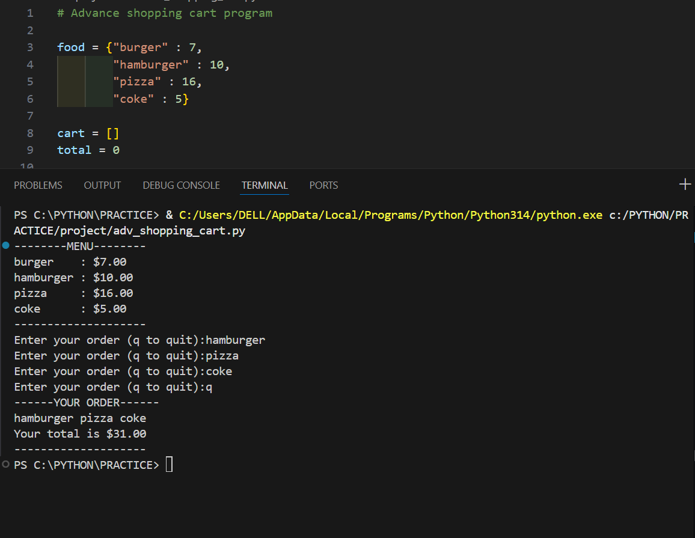

# 🛒 Python Shopping Cart Program

A simple **command-line shopping cart program built using Python**.  
This program displays a food menu, allows users to place orders, and calculates the total cost of the selected items.

This project is part of my learning journey while practicing **Python basics and program logic**.

---

## 🚀 Features

- Displays a formatted food menu with prices
- Allows users to add items to a cart
- Supports multiple orders
- Calculates the total bill
- Simple command-line interface

---

## 🛠 Built With

- Python
- Basic programming concepts:
  - Dictionaries
  - Lists
  - Loops
  - Conditional statements
  - User input handling

---

4. Run the program:

```bash
python shopping_cart.py
```

5. Enter food items from the menu to add them to your cart.
6. Press **q** to finish ordering and see the total bill.

---

## 📸 Output Screenshot



---

## 📚 What I Learned

While building this project I practiced:

- Working with **dictionaries to store menu items**
- Using **lists to manage a shopping cart**
- Writing **loops for continuous user input**
- Implementing **simple billing logic**

---

## ⭐ Project Purpose

This project is part of my **Python practice projects**, where I build small applications to strengthen my understanding of core programming concepts.

---

💻 Beginner Python Project
